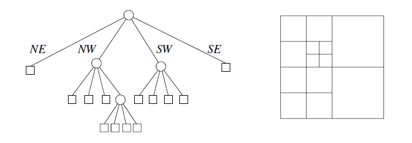

# Algo
 Visualizers for mostly geoemtric algorithms

## Algorithms

- Quadtrees
    - Quadtree Construction
    - Balanced Quadtree Construction
    - 2D Non-Uniform mesh Construction

- Visibility Graphs

## Quadtrees

A quadtree is a rooted tree in which every internal node
has four children. Every node in the quadtree corresponds
to a square. If a node ν has children, then their 
corresponding squares are the four quadrants
of the square of ν (hence the name of the tree).

### Quadtree Construction

